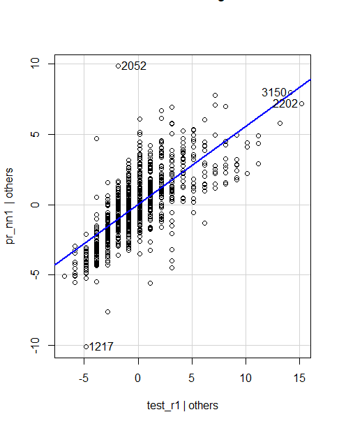
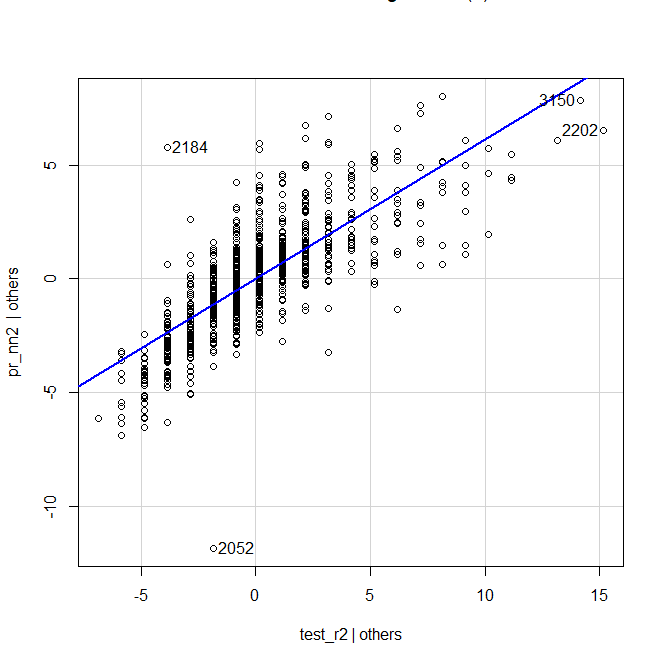
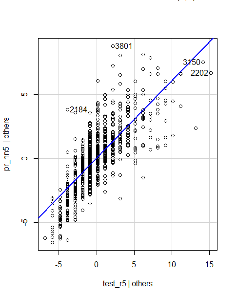
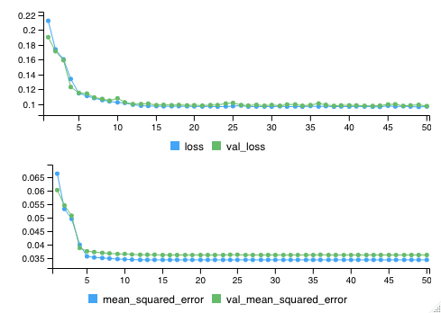

```{r setup, include=FALSE}
knitr::opts_chunk$set(echo = TRUE)
```

# Introduction

This vignette report outlines the process of our exploration of Neural Network Architecture and how it affects the outcome of the model. Below, we will summarize our background research on the different aspects of neural network architecture, the data we decided to conduct our exploration with, how we tested the different aspects of neural netnarchitecture, and our conclusions as to how changes to the architecture affected the outcome of our model fitting.

# Neural Network Architecture Background

## Layers

An artificial neural network is constructed of three types of layers:

-   Input Layer: where the initial data is taken in

-   Output Layer: where the results are produced for given inputs

-   Hidden Layers: where all of the computation is done, between the input and output layers

The hidden layers are composed of 'activation nodes', each having functions that pre-determine to what extent the node will be 'activated' based on the given weight. The weight is what connects the nodes between the neighboring layers. This weight is thought of as the "impact that that node has on the node from the next layer" (Towards Data Science).

The weights between neural network layers can be quantified as a matrix, which we can call $\theta$. If a network has $a$ units in layer $j$ and $b$ units in layer $(j+1)$, then $\theta_j$ will have dimensions $b*(a+1)$: $$\theta_j = 
\begin{bmatrix}
\theta_{1,1} & \theta_{1,2} & \dots & \theta_{1,(a+1)} \\
\theta_{2,1} & \theta_{2,2} & \dots & \theta_{2,(a+1)} \\
\vdots & \vdots & \ddots & \vdots \\
\theta_{b,1} & \theta_{b,2} & \dots & \theta_{b,(a+1)} \\
\end{bmatrix}
$$

To compute the activation nodes, say $a^{(L)}_n$ where L is the number of layers with n nodes, for each of the hidden layers, we would multiply an input vector, say $X$, by the weights \$\\theta\$, and then apply the activation function, $g$, to get something like this:

$$
a^{(L)}_1 = g(\theta_{1,1}x_1 + \theta_{1,2}x_2 + \dots + \theta_{1, (a+1)}x_k) \\
a^{(L)}_2 = g(\theta_{2,1}x_1 + \theta_{2,2}x_2 + \dots + \theta_{2, (a+1)}x_k) \\
\vdots \\
a^{(L)}_n = g(\theta_{b,1}x_1 + \theta_{b,2}x_2 + \dots + \theta_{b, (a+1)}x_k)
$$

## Activation Functions

Like we noted earlier, the activation function pre-determines whether each node should be 'activated' or not based on the weighted sum value. The main goal of the activation function is to take the weighted input from a node and output a value that is then either fed into the next hidden layer or sent as an output. It is used to introduce non-linearity into neural networks.

The activation function within a neural network works differently depending on the flow of information within that neural network. This movement of information can be described as either Feedforward or Back Propagation within the context of neural networks (V7 Labs).

#### Feedforward Propagation:

When the flow of information in a neural network moves in a forward direction. The input is used for calculations in the hidden layer, and those calculations in the hidden layer are used to calculate the output value. Here, the activation function acts as a "gate" between what goes into the input layer and its output into the next hidden layer (V7 Labs).

#### Back Propagation:

When the network's weights and biases are adjusted repeatedly in hopes of minimizing the difference between the real output vector of the neural net and the predicted output vector of the neural net. This difference is called the cost function, and its gradients determine the level of adjustment with respect to the activation function, weight, bias, etc. (V7 Labs).

#### Common Activation Functions:

-   Identity: $\sigma(x)=x$

-   Sigmoid: $\sigma(x)=\frac{1}{1+e^{-x}}$

-   Hyperbolic tangent: $\sigma(x)=\frac{e^x - e^{-x}}{e^x+e^{-x}}$

-   Rectified linear unit: $\sigma(x)=\text{max}(0,x)$

## Epochs

An epoch is the interval in which the neural network completes everything. In one epoch, you pass in all of your parameters, calculate the loss according to your metric, and compute the partial derivatives of the loss function, and update the resultant weights on the neural network through backpropagation. An epoch is effectively the number of times the neural network "sees" the dataset.

Generally, we do not feed all of the data into the model all at the same time, but rather in "batches". The batch size is the number of training examples in one forward pass and resultant backwards pass through the model. The number of epochs is determined by the training and validation error. So long as the error rate continues to drop, we should continue updating our model.

An iteration is the number of steps in a single batch. So if we have 100 total data points in our training set, and 5 batches, we would need 20 iterations to complete one iteration.

# Architecture Exploration Results

## Using Artificial Neural Networks for Regression

For our purposes, we thought it best to examine neural network architectures in a regression problem. Artificial Neural Networks are used for regression in order to learn the complex, non-linear relationships that are sometimes present between target and features. They are able to do this due to the presence of the activation functions within each layer (Analytics Vidhya). Because we

We chose to conduct our exploration using the abalone dataset built into R. The dataset contains data on 4177 abalones with feature variables such as type (male, female, or infant), diameter, height, longest shell measurements, and various weights. Our target variable, and what we are trying to predict, is the age of the abalone. The data is supervised, as this target can be calculated by adding 1.5 to the number of rings.

## Layers and Nodes Exploration

### MSE

To see if having single layers or multiple layers plays a role in improving MSE (mean square error), we decided to have three examples for each single layer ANN and multiple-layer ANN, using a Logistic Regression activation function and setting the algorithm to "rprop+".

For single layer, we set models to 1, 5, 6 hidden nodes for the single layer as shown below:

{width="400"}

Single layer with 1 node. MSE: 10.78287

{width="400"}

Single layer with 5 nodes. MSE: 10.04245

{width="400"}

Single layer with 6 nodes. MSE: 9.991573

As shown above, the MSE has decreased as the number of nodes decrease for single layer ANN. Although, when I tried to run for 8 and 10 nodes, the code would not run, which may indicate that below 6 nodes may be enough.

However, in the case for multiple-layer ANN, we see something different. We set models to 2 by 2, 5 by 3, and 8 by 6 hidden nodes for the multiple layer as shown below:

{width="400"}

Multiple layer with 2 by 2 nodes. MSE: 9.967073

{width="400"}

Multiple layer with 5 by 3 nodes. MSE: 10.01608

{width="400"}

Multiple layer with 8 by 6 nodes. MSE: 10.33044

In this case, with just the 2 nodes per layer, we already see that the MSE is already lower than all previous examples with a single layer. However, once we increase the first and second layer, the MSE increases. This indicates that there is more nodes than needed and may be a sign of over training. This indicates that the best model is where there is more nodes for a single layer or less nodes for a multiple layer for this dataset. In our case, the 2 by 2 multiple layer is our best model as it has the lowest MSE.

### R-squared (measuring predictability of models)

We can also measure if single layer is better than multiple layers in the sense that it could accurately measure the actual values of the abalone age. We plotted a fitted weighted plot for each of the 6 models above that shows the relationship between predicted values (y axis) and actual values (x axis):

{width="260"}

Single layer with 1 node. R-squared: 0.5169197

{width="260"}

Single layer with 5 nodes. R-squared: 0.5885074

{width="260"}

Single layer with 6 nodes. R-squared: 0.5931386

We see that the R-squared increases as the number of nodes increases. In the plots, we can see the the points are getting closer and closer to the regression line, indicating if we can accurately predict an abalone age given its features, such as type (male, female, or infant), diameter, height, longest shell measurements, number of rings, and various weights. And all weighted R-squared values are all over 0.5, indicating that we have a pretty good correlation between our predicted and actual values of age.

Now on to the multiple layers. We see a different case for the models to 2 by 2, 5 by 3, and 8 by 6 hidden nodes as shown below:

{width="360"}

Multiple layer with 2 by 2 nodes. R-squared: 0.5839595

{width="360"}

Multiple layer with 5 by 3 nodes. R-squared: 0.5912586

{width="360"}

Multiple layer with 8 by 6 nodes. R-squared: 0.5419721

As seen here, as the nodes increase for multiple layer ANN, we see R-square increase, until it reaches too many nodes as shown by the 8 by 6 nodes, where weighted R-square decreased. Overall, we see that our model for single layer of 6 nodes had the best weighted R-squared, meaning its predicted values were very similar to its actual values with a strong correlation of almost 0.6. However, all models had an R-square of over 0.5, indicating that all models did a pretty good job of estimating our real values of abalone age.

## Epochs Exploration

To explore how the number of epochs in our neural network affected the outcome of the regression task, we build a neural net model and ran it using various numbers of epochs. We set the model to have three hidden layers, a Rectified Linear Unit activation function, and a validation split set to 0.3.

We ran the model with 10, 50, and 100 epochs and compared the results of each run, shown below:

{width="424"}




As you can see in the improvement in MSE from 10 to 50 and 100 epochs, we did see a better accuracy when adding more epochs to the neural network. However, adding more epochs to the model doesn't always necessary make the model more accurate, as seen in comparing the MSE from 50 to 100 epochs. This was due to the model overfitting to the data as too many epochs were being added. Our optimal outcome was achieved by using 50 epochs to fit our neural network.

# Conclusion

[(Interpretation]

What we can interpret about neural network architecture from the things we did and what we changed.

Based on our models, we that as we see that having multiple layer of less nodes has a lower MSE, indicating that overall predicted and actual value difference was pretty small. This means that having multiple layers may accurately depict our actual values of abalone age, however, there is such thing of over training, where the MSE will increase if there is too many nodes. For weighted R-squared, we see that having more nodes for a single layer and less nodes for a multiple layer has a higher weighted R-squared, indicating that predicted ages were very similar to the actual ages of the abalone. All had a weighted R-squared of over 0.5. We also see that as we increase the number of epochs to a certain point, in this case it was 50, the model was more accurate. However, too many epochs such as 100 in our case, may have caused overfitting as the model was not as accurate as the 50 epochs model.
